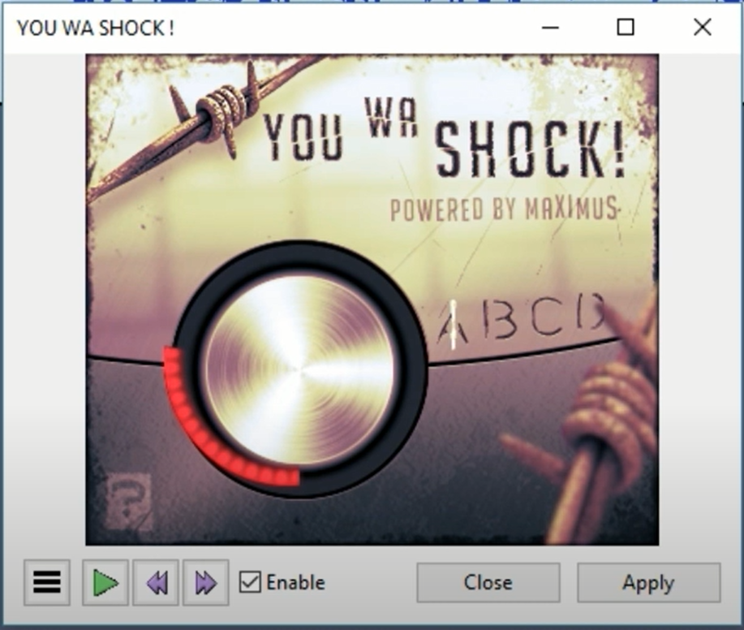
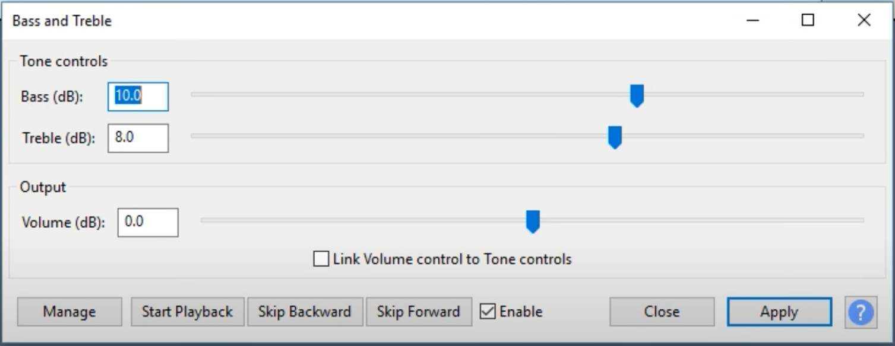
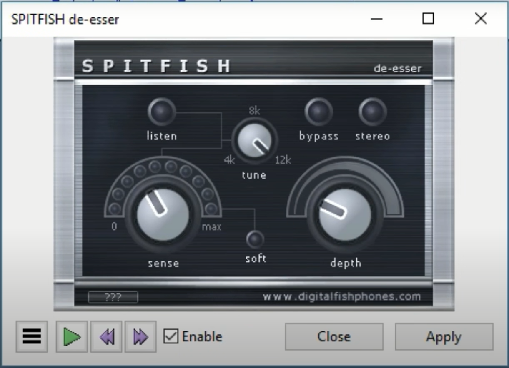
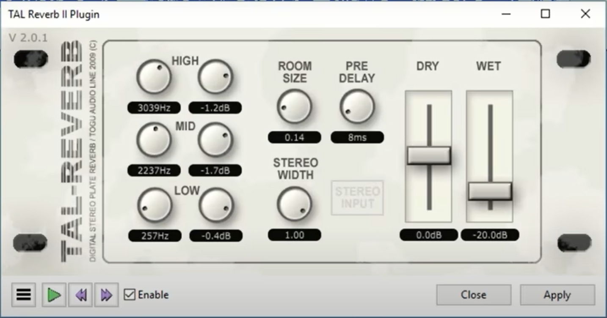
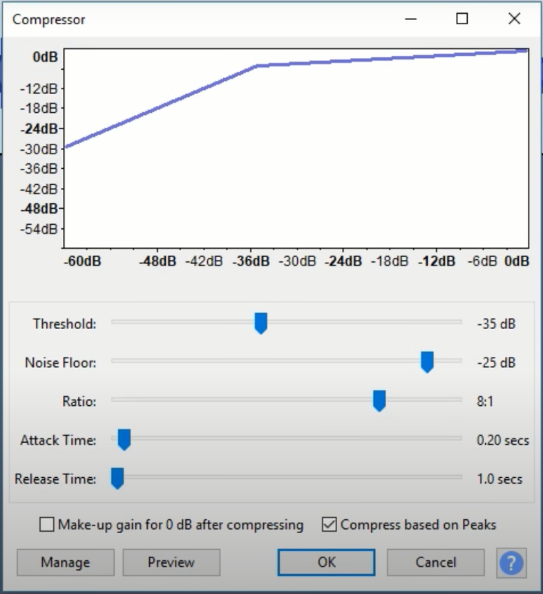

```{r setup, include=FALSE}
library(knitr)
opts_chunk$set(fig.pos = "H", fig.align = "center")
options(knitr.kable.NA = " ")
```

Recomendaciones de Jason R. [@Blue2019].

# Paso a paso:

## **Seleccionar todo el audio**

## Plugin: [**YOU WA SHOCK!**](https://sites.google.com/site/youwashockvst/)

-   Poner el dial más o menos a ¼ (25%) o un tris más

    

-   Aplicar

## Ir al efecto **Graves y agudos**

-   **Graves (db)**: 10

-   **Agudos (dB)**: 8

    

-   Clic en **Aplicar**

## Plugin: [**SPITFISH de-esser**](http://digitalfishphones.com/main.php?item=2&subItem=5)

-   Usar estos valores:

    

-   Clic en **Aplicar**

## Plugin: [**TAL Reverb II Plugin**](https://tal-software.com/products/tal-reverb)

-   Usar estos valores:

    

-   Clic en **Aplicar**

## Ir al efecto **Compresor**

-   **Umbral**: -35 dB

-   **Límite inferior de ruido**: -25 dB

-   **Proporción**: 8:1

-   **Tiempo de ataque**: 0.20 secs

-   **Tiempo de decaimiento**: 1.0 secs

-   **Composición de ganancia para 0 dB tras compresión**: ✗

-   **Compresión basada en picos**: ✓

    

-   Clic en **OK**

# Referencia
